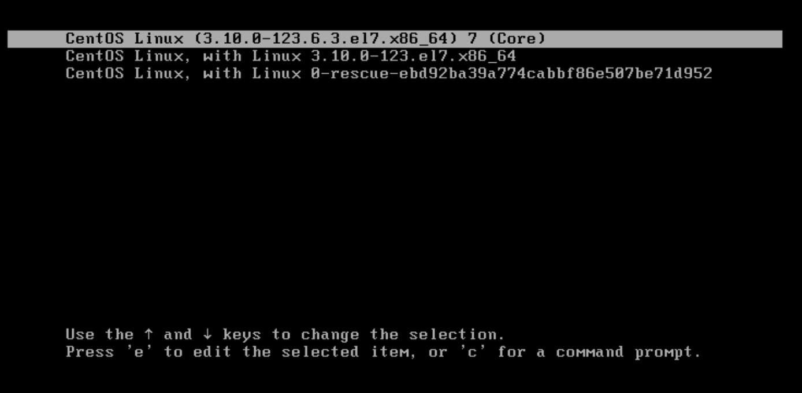
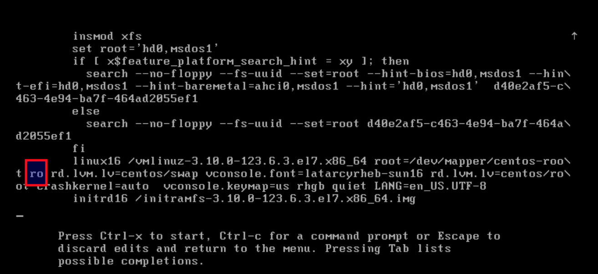
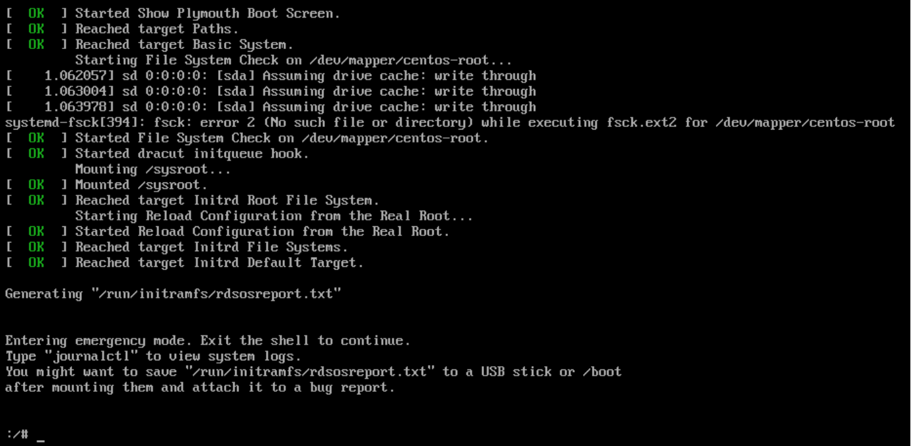

# 2017-fall-team-02


Our deliverables are in the form two RPM's file namely `vmhost-1.0-1.x86_64.rpm` and `vclonusb-1.0-1.x86_64.rpm`. 

Steps to install the hypervisor, get the `mn` running and create a new user from the rpm files:

## Step 1

### vmhost-1.0-1.x86_64.rpm:
This RPM file installs the hypervisor and its dependecies, perform network configuration and creates the management node mn. 
Github does not allow files larger than 100 mb to be uploaded. The link to RPM [vmhost-1.0-1.x86_64.rpm](https://drive.google.com/open?id=1nWGPp_YYRGlT9-8QIxSJu2FkH1BoSog4)

The RPM is only compatible with **centOS 7**. 

Instruction for running this RPM file :

1. Log into vmhost:

2. Install rpm build: 

`yum install rpm-build`

3. Installing rpm file:

`rpm -i vmhost-1.0-1.x86_64.rpm`

4. Run the script by running: 
   `initial_setup_management_node.sh`


## Step 2
Once the management node is up we need to change the password of the VM, as the ssh keys are not properly populated.
The work around for ssh keys not properly populated is mentioned below:

### Change Root Password in CentOS 7

1) In the boot grub menu select option to edit.

Select Option to edit (e).

2) Go to the line of Linux 16 and change ro with rw init=*/sysroot/bin/sh*.


3) Now press `Control+x` to start on single user mode.


4) Now access the system with this command: chroot /sysroot

5) Enter : *passwd root*

6) Reset  the password.

7) Update SELinux information touch /.autorelabel

8) Exit chroot : exit

9) Reboot the system: reboot 

**Once the password has been changed the user needs to log into the VM and enable Virsh console using the following steps:**

login to the virtual machine and edit /etc/default/grub

GRUB_CMDLINE_LINUX="crashkernel=auto rd.lvm.lv=centos/root rd.lvm.lv=centos/swap rhgb quiet console=ttyS0"

Enable Serial Console Access on the KVM host:
login to the host machine to edit the xml file relating to that virtual machine
virsh edit <vm-name>

Replacing <vm-name> with the correct virtual machine name.
Once you are in the configuration you will need to change
```
 <console type='pty'>
 <target type='serial' port='0'/>
 </console>
```

To

```
<console type='pty' tty='/dev/pts/6'>
 <source path='/dev/pts/6'/>
 <target type='serial' port='0'/>
 <alias name='serial0'/>
 </console>
 
```

Then you can go ahead and save that file, by default it uses vi, so to save type
`:wq`.

Then go ahead shut down the vm:
`virsh shutdown <vm-name>`.

Then recreate it:
`virsh start <vm-name>`.

You should now be able to attach a console to the virtual machine by running:
`virsh console <vm-name>`.

To exit out of a virsh console you will need to press `ctrl + ]` and that will break out of the console session.

## Step 3 
### vclonusb-1.0-1.x86_64.rpm:

This RPM file install vcld components, phpadmin and creates a new user.

The RPM is only compatible with **centOS 7**. 

The RPM file can be tested standalone on **VCL Sandbox Base(CentOS 7)**. 

Instruction for running the RPM :

1. Log into mn

2. Install rpm build: 

`yum install rpm-build`

3. Installing rpm file:

`rpm -i vclonusb-1.0-1.x86_64.rpm`

4. Run the script by running: 

`vcl_final_user`
